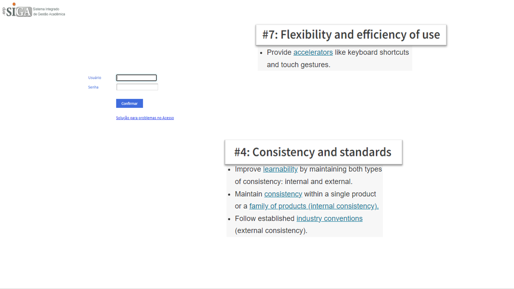
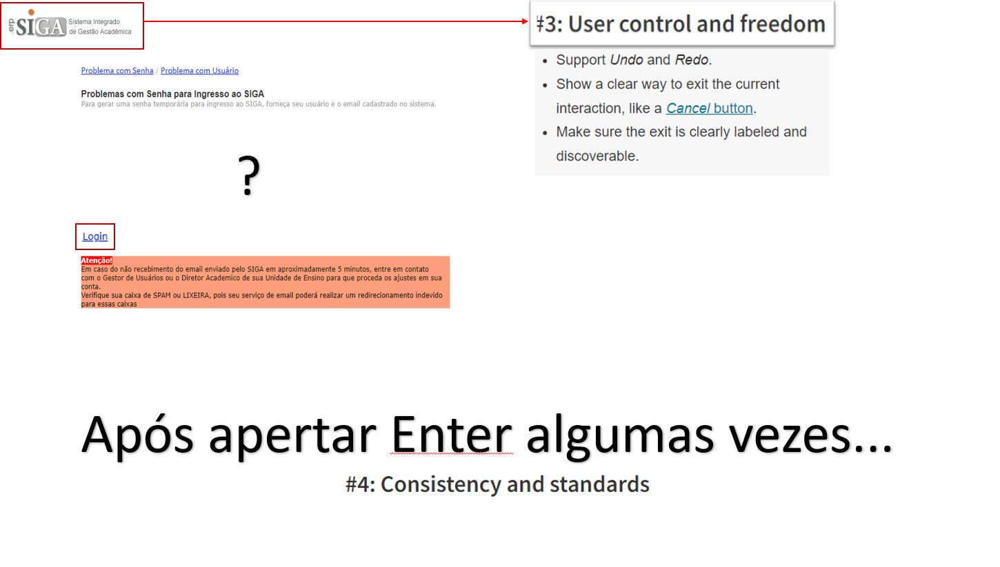
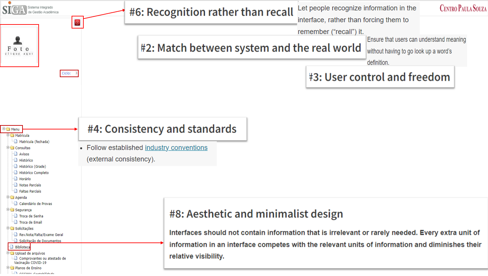

# Problemas de heurística no site do SIGA

### Página de Login

 
Aqui temos problemas de que não há flexibilidade no uso da tela de cadastro para o site, em que, ao completar os campos de login, não se pode apertar a tecla Enter
para que seja feito o request, e então, o login seja realizado.
 
### Reportar Problemas de Usuario

 
Ao entrar no link de "Solução de Problemas de Acesso", somos redirecionados para uma página onde é pedido o nome do usuário, porém, caso o usuário tenha esquecido o nome de usuário cadastrado,
não há alternativa para este caso. Caso interessante é que a tecla enter funciona para o envio de requisições nesta página.
 

 
Após apertar a tecla Enter algumas vezes, o campo de informações simplesmente desaparece. Aparecendo apenas um link escrito "Login" na tela.
 

 
Ao clicar no link de Login, somos direcionados para uma página LocalHost inválida.
 
### Página Principal do SIGA

 
Ao entrar na página principal do siga, já nos deparamos com "alguns" problemas, como a apresentação de algumas informações erradas, como por exemplo, o Ciclo em que o aluno se encontra está errado. Há também a apresentação da foto de perfil, escrita "clique aqui", porém, quando é clicada, nada acontece.
 
Também há algumas informações irrelevantes na tela sendo apresentadas, que é o caso do link para a Biblioteca, que quando clicado, não redireciona para nenhum lugar nem exibe informação.
 
Além disto, também há o problema com o retorno para o menu principal que é apresentado no site. onde o Botão escrito "Menu" apenas fecha pastas, e não redireciona para lugar nenhum.
 
E por fim, não há maneira intuitiva de realizar o logoff do site, com o botão para realizar tal ato sendo um quadrado com uma imagem.
